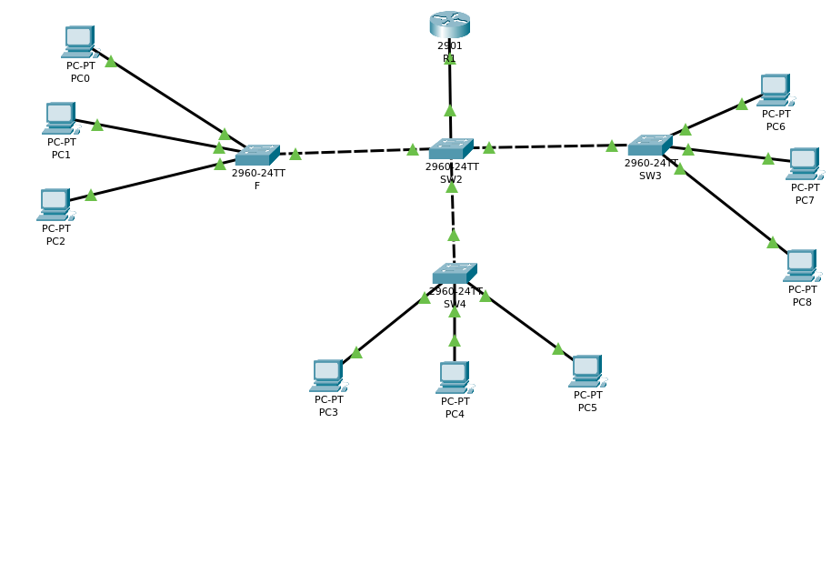
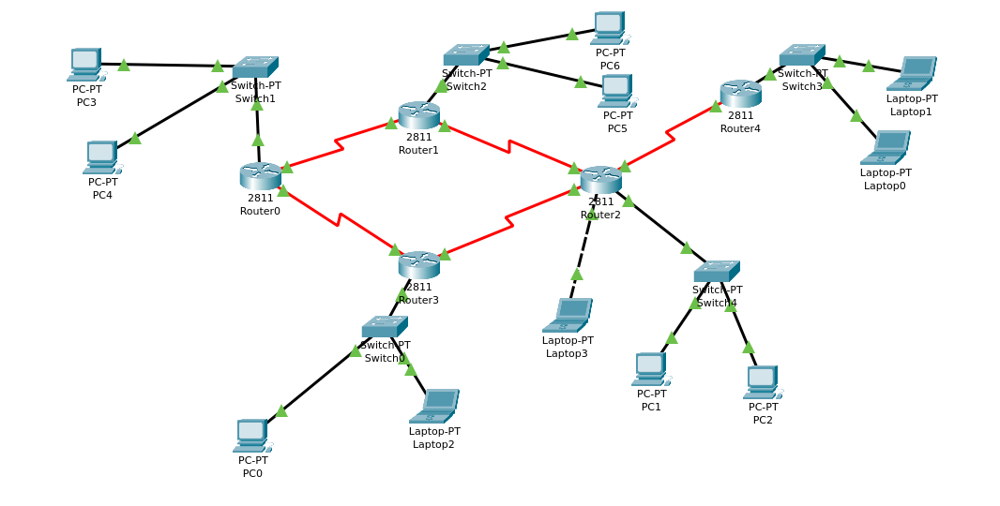

# 🌐 Cisco Packet Tracer — Network Engineering Labs

<div align="center">


### Hands-on network engineering labs  built and tested in Cisco Packet Tracer.

**By Sarwar**

</div>

---

## 📋 Table of Contents
- [Project 1 — Enterprise VLAN Network](#-project-1--enterprise-vlan-network)
- [Project 2 — Multi-Branch WAN with OSPF](#-project-2--multi-branch-wan-with-ospf)

---

## 🏢 Project 1 — Enterprise VLAN Network

### 🎯 Objective
Design and implement a segmented enterprise network that isolates three departments (HR, IT, Finance) into separate VLANs, with a router handling all inter-department traffic.

### 🖧 Topology
```
                      ┌─────────────┐
                      │   Router0   │
                      │  (2811)     │
                      └──────┬──────┘
                             │ Trunk (802.1Q)
                      ┌──────┴──────┐
                      │   Switch0   │
                      │  (2960)     │
                      └──┬────┬────┬┘
                    Fa0/1│  Fa0/2│  Fa0/3│
                  ┌──────┘  ┌───┘  ┌────┘
                  │         │      │
               [PC-HR]  [PC-IT]  [PC-Finance]
               VLAN 10  VLAN 20   VLAN 30
          192.168.10.10 192.168.20.10 192.168.30.10
```

### 📦 Devices Used
| Device | Model | Role |
|--------|-------|------|
| Router0 | Cisco 2811 | Inter-VLAN routing via sub-interfaces |
| Switch0 | Cisco 2960 | VLAN segmentation and trunk port |
| PC-HR | PC | VLAN 10 — 192.168.10.10 |
| PC-IT | PC | VLAN 20 — 192.168.20.10 |
| PC-Finance | PC | VLAN 30 — 192.168.30.10 |

### 🌐 IP Addressing
| VLAN | Name | Network | Gateway | PC Address |
|------|------|---------|---------|------------|
| 10 | HR | 192.168.10.0/24 | 192.168.10.1 | 192.168.10.10 |
| 20 | IT | 192.168.20.0/24 | 192.168.20.1 | 192.168.20.10 |
| 30 | Finance | 192.168.30.0/24 | 192.168.30.1 | 192.168.30.10 |

### ⚙️ Key Configuration
**Switch — VLAN creation and port assignment:**
```bash
vlan 10
 name HR
vlan 20
 name IT
vlan 30
 name FINANCE

interface fastEthernet 0/1
 switchport mode access
 switchport access vlan 10

interface fastEthernet 0/24
 switchport mode trunk
```

**Router — Inter-VLAN routing (router-on-a-stick):**
```bash
interface gigabitEthernet 0/0.10
 encapsulation dot1Q 10
 ip address 192.168.10.1 255.255.255.0

interface gigabitEthernet 0/0.20
 encapsulation dot1Q 20
 ip address 192.168.20.1 255.255.255.0

interface gigabitEthernet 0/0.30
 encapsulation dot1Q 30
 ip address 192.168.30.1 255.255.255.0
```

### ✅ Verification
```bash
show vlan brief                 # Confirm VLANs are active
show interfaces trunk           # Confirm trunk is up
ping 192.168.20.10              # HR pings IT — should succeed
ping 192.168.30.10              # HR pings Finance — should succeed
```

### 📸 Screenshots


---

## 🌍 Project 2 — Multi-Branch WAN with OSPF

### 🎯 Objective
Connect two geographically separate branch offices over a WAN serial link and configure OSPF dynamic routing so all devices across both branches can communicate automatically.

### 🖧 Topology
```
   BRANCH A                                    BRANCH B
   ────────                                    ────────
  [PC-A1]  [PC-A2]                        [PC-B1]  [PC-B2]
  .10        .11                           .10        .11
     │          │                             │          │
  ┌──┴──────────┴──┐                    ┌──┴──────────┴──┐
  │   Switch-A     │                    │   Switch-B     │
  └───────┬────────┘                    └───────┬────────┘
          │ Gig0/0                      Gig0/0  │
  ┌───────┴────────┐                    ┌───────┴────────┐
  │   Router-A     │                    │   Router-B     │
  │  192.168.1.1   ├────────────────────┤  192.168.2.1   │
  └────────────────┘  S0/0/0──S0/0/0   └────────────────┘
                       10.10.10.0/30
  LAN: 192.168.1.0/24                  LAN: 192.168.2.0/24
```

### 📦 Devices Used
| Device | Model | Role |
|--------|-------|------|
| Router-A | Cisco 2811 + WIC-2T | Branch A gateway, OSPF speaker |
| Router-B | Cisco 2811 + WIC-2T | Branch B gateway, OSPF speaker |
| Switch-A | Cisco 2960 | Branch A local switch |
| Switch-B | Cisco 2960 | Branch B local switch |
| PC-A1, PC-A2 | PC | Branch A clients |
| PC-B1, PC-B2 | PC | Branch B clients |

### 🌐 IP Addressing
| Segment | Network | Router IP | PC Range |
|---------|---------|-----------|----------|
| Branch A LAN | 192.168.1.0/24 | 192.168.1.1 | .10 – .11 |
| Branch B LAN | 192.168.2.0/24 | 192.168.2.1 | .10 – .11 |
| WAN Link | 10.10.10.0/30 | .1 (A) / .2 (B) | N/A |

### ⚙️ Key Configuration
**Router-A:**
```bash
interface gigabitEthernet 0/0
 ip address 192.168.1.1 255.255.255.0
 no shutdown

interface serial 0/0/0
 ip address 10.10.10.1 255.255.255.252
 clock rate 64000
 no shutdown

router ospf 1
 network 192.168.1.0 0.0.0.255 area 0
 network 10.10.10.0 0.0.0.3 area 0
```

**Router-B:**
```bash
interface gigabitEthernet 0/0
 ip address 192.168.2.1 255.255.255.0
 no shutdown

interface serial 0/0/0
 ip address 10.10.10.2 255.255.255.252
 no shutdown

router ospf 1
 network 192.168.2.0 0.0.0.255 area 0
 network 10.10.10.0 0.0.0.3 area 0
```

### ✅ Verification
```bash
show ip ospf neighbor            # Confirm Router-B appears as OSPF neighbor
show ip route                    # Confirm 192.168.2.0 learned via OSPF (O prefix)
ping 192.168.2.10                # Branch A pings Branch B — should succeed
```

### 📸 Screenshots


---

<div align="center">


</div>
